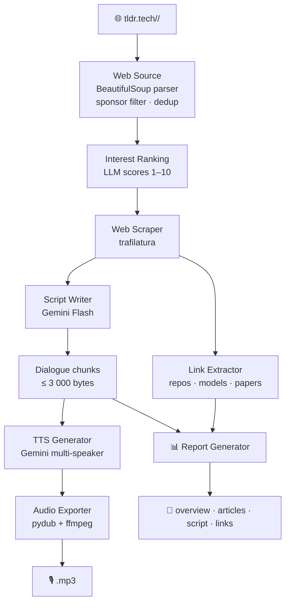

# tldr-podcast


Fetches TLDR newsletters directly from [tldr.tech](https://tldr.tech) and converts them into
a two-voice podcast MP3 using Gemini AI.

---

## Architecture



---

## Features

| Feature | Details |
| --- | --- |
| 🌐 Web source | Fetches newsletters directly from `tldr.tech/<topic>/<YYYY-MM-DD>` — no account needed |
| 📅 Multi-topic | Combine topics like `ai,devops,infosec` in one podcast |
| 🗂️ Interactive picker | `questionary` checkbox lets you pick topics interactively |
| 🚫 Sponsor filter | Strips `TOGETHER WITH`, `SPONSOR`, promo sections and UTM-tagged URLs |
| 🌐 Article scraping | Full text via trafilatura, fallback to newsletter summary |
| 🔗 Link extraction | Categorises URLs into repos, models, papers, sources |
| 🎯 Interest ranking | LLM scores articles 1–10 by interest before scraping; top `max_articles` kept |
| 📄 Full-text pipeline | Scraped full text sent directly to the script writer for maximum dialogue quality |
| ⚡ Service tiers | Support for `flex` (cheaper) and `priority` (faster) API tiers |
| 🎙️ Two-voice TTS | Configurable speaker names, voices, and personalities |
| 🌍 Multi-language | Dialogue and TTS language configurable (`language` key) |
| 🎵 MP3 / WAV export | pydub + ffmpeg, auto-creates output directories |
| 📊 Report generation | Enabled by default — creates a timestamped folder with overview, articles, script, and links (`--no-report` to disable) |
| 💰 Token tracking | Real-time token usage and cost display on progress bars, tier-aware pricing |
| 🔍 Dry-run mode | Print dialogue without calling TTS |
| 🔄 Retry logic | Automatic retry with backoff for transient API failures |
| 🛠️ Config wizard | Interactive `config init` to bootstrap your configuration |

---

## Installation

### Prerequisites

- Python 3.13+
- [uv](https://docs.astral.sh/uv/) package manager
- ffmpeg

```bash
# Ubuntu / Debian
sudo apt-get install -y ffmpeg

# macOS
brew install ffmpeg
```

### Install with uv

```bash
git clone <repo-url> tldr-podcast
cd tldr-podcast

# Install as a CLI tool
uv tool install .

# Or for development (editable install)
uv sync && uv pip install -e .
```

---

## Configuration

The default configuration file is `$XDG_CONFIG_HOME/tldr/config.yaml`
(falls back to `~/.config/tldr/config.yaml` when `XDG_CONFIG_HOME` is unset).

Run the interactive wizard to create it:

```bash
tldr-podcast config init
```

Or copy the example and edit manually:

```bash
cp config.example.yaml "${XDG_CONFIG_HOME:-$HOME/.config}/tldr/config.yaml"
```

```yaml
web:
  default_topics: [ai, infosec, devops]   # pre-checked in interactive mode
  user_agent: "tldr-podcast/1.0"
  timeout_seconds: 15

gemini:
  api_key_env: GEMINI_API_KEY   # name of env var holding the API key
  text_model: gemini-2.0-flash
  selection:
    model: gemini-2.0-flash-lite   # cheap model for interest scoring
  tts_model: gemini-2.5-flash-preview-tts
  # service_tier: flex          # optional: flex | priority (omit for standard)
  language: French              # dialogue and TTS language
  speaker1:
    name: Alex
    voice: Puck
    personality: "enthusiastic, curious, quick to get excited about tech innovations"
  speaker2:
    name: Jordan
    voice: Charon
    personality: "analytical, mildly skeptical, adds nuance and historical context"
  dialogue:
    min_articles: 8
    max_articles: 12
    target_word_count: 1200
  tts_style:
    pace: "slow and deliberate"
    scene: "Two friends co-hosting a casual French tech podcast in a cozy studio"
    temperature: 1.2

scraping:
  max_articles: 15
  timeout_seconds: 10

output:
  dir: "."       # override per-run with --output-dir
  format: mp3    # mp3 or wav

pricing:         # USD per 1M tokens (for cost tracking)
  gemini-2.0-flash:
    input_per_1m: 0.10
    output_per_1m: 0.40
  gemini-2.5-flash-preview-tts:
    input_per_1m: 0.50
    output_per_1m: 10.00
```

Keys ending in `_env` reference environment variable **names** — the actual
secrets are never stored in the file.

### Environment Variables

| Variable | Description |
| --- | --- |
| `GEMINI_API_KEY` | Gemini API key (Google AI Studio) |

Export it or add to a `.env` file:

```bash
export GEMINI_API_KEY="your-key"
```

---

## Usage

### Supported Topics

`ai` · `infosec` · `tech` · `crypto` · `founders` · `dev` · `it` · `design` · `product` · `devops` · `marketing` · `data` · `fintech`

### CLI Commands

All `run` commands use `$XDG_CONFIG_HOME/tldr/config.yaml` by default.
Pass `--config path/to/config.yaml` to override.

| Command | Description |
| --- | --- |
| `tldr-podcast run` | Interactive topic picker then generate podcast |
| `tldr-podcast run -t ai,devops` | Fetch specific topics, skip prompt |
| `tldr-podcast run -t infosec --no-interactive` | Non-interactive, explicit topics |
| `tldr-podcast run -d 2026-04-06` | Target a specific date |
| `tldr-podcast run -t ai -n` | Dry-run: print dialogue only, no TTS |
| `tldr-podcast run -R` | Skip report generation (`--no-report`) |
| `tldr-podcast run -o ./podcasts` | Write output to a specific directory |
| `tldr-podcast run --no-progress` | Disable rich progress bar |
| `tldr-podcast run -v` | Enable DEBUG logging |
| `tldr-podcast config init` | Interactive configuration wizard |
| `tldr-podcast config show` | Display the current configuration |
| `tldr-podcast config show --resolve` | Display config with resolved env vars (masked) |

**Short flags:** `-c` config, `-t` topics, `-d` date, `-o` output-dir, `-n` dry-run, `-v` verbose, `-r`/`-R` report/no-report, `-h` help.

### Output Naming

The podcast filename is built from the topics (sorted alphabetically) and the date:

```
ai-devops-2026-04-17.mp3
ai-devops-2026-04-17/overview.md
ai-devops-2026-04-17/articles.md
ai-devops-2026-04-17/script.md
ai-devops-2026-04-17/summary.md
```

`ai,devops` and `devops,ai` produce the same filename.

### Example — dry-run on today's AI and infosec newsletters

```bash
tldr-podcast run --topics ai,infosec --no-interactive --dry-run
```

### Example — full pipeline with report

```bash
tldr-podcast run -t ai,devops -d 2026-04-17
# → ./ai-devops-2026-04-17.mp3
# → ./ai-devops-2026-04-17/overview.md
# → ./ai-devops-2026-04-17/articles.md
# → ./ai-devops-2026-04-17/script.md
# → ./ai-devops-2026-04-17/summary.md
```

---

## Tests

```bash
uv run pytest tests/ -v
```

All external APIs (Gemini, HTTP) are mocked. A real captured TLDR HTML page
lives in `tests/fixtures/` and is used by `test_web_source.py` for
realistic parse validation.

---

## Project Structure

```text
tldr-podcast/
├── config.example.yaml        # Documented configuration template
├── pyproject.toml
├── src/tldr/
│   ├── cli.py                 # Click CLI entry point
│   ├── config.py              # YAML loader with *_env resolution
│   ├── models.py              # Shared Article dataclass
│   ├── web_source.py          # tldr.tech HTML fetcher + parser
│   ├── web_scraper.py         # trafilatura full-text scraper
│   ├── link_extractor.py      # URL extraction and categorisation
│   ├── llm_summarizer.py      # Interest ranking + dialogue generation
│   ├── tts_generator.py       # Gemini multi-speaker TTS
│   ├── audio_exporter.py      # PCM → MP3/WAV via pydub
│   ├── report_generator.py    # Timestamped report folder output
│   ├── token_tracker.py       # Token usage and cost tracking
│   └── retry.py               # Retry with exponential backoff
├── tests/
│   ├── fixtures/              # Real captured HTML for parse tests
│   └── ...                    # pytest unit tests (all APIs mocked)
└── mails/                     # Legacy sample files (not used by pipeline)
```

---

## Notes

- Gemini TTS outputs raw PCM (24 kHz, mono, 16-bit). ffmpeg is required for MP3 encoding.
- The TTS API has a ~4 000-byte text limit per call. The dialogue generator automatically
  splits output at speaker-turn boundaries (≤ 3 000 bytes/chunk).
- Sponsor sections (`TOGETHER WITH`, `SPONSOR`, `PROMOTION`) and articles with
  `utm_medium=sponsor` in their URL or `(Sponsor)` in their title are filtered out
  automatically.
- Token costs are tracked live and displayed at the end of each run.
- Pricing supports both flat and tier-aware formats — the active tier is selected by
  `gemini.service_tier` in your config.

---

## Changelog

### v1.0.0 — Web-only pipeline (breaking change)

Switched from IMAP/email-based fetching to direct web scraping of
[tldr.tech](https://tldr.tech).  No account or email credentials are needed.
The `-e/--eml`, `-s/--status` CLI flags, and the `imap:` config section have
been removed.  Use `--topics` and `--no-interactive` instead.

---

*Author: Grégoire Compagnon — <obeone@obeone.org>*
