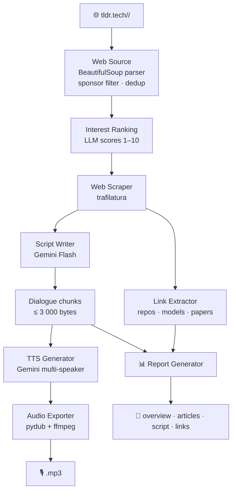

# tldr-podcast


**Turn your TLDR newsletters into a listenable two-voice podcast — automatically.**

Fetches any combination of [TLDR](https://tldr.tech) topic newsletters, selects the most
interesting articles, and generates a scripted dialogue + audio via Gemini AI. No email account
required.

---

## Features

- **Zero-config fetching** — pulls newsletters directly from `tldr.tech`, no email or subscription needed
- **13 topics** — `ai`, `infosec`, `devops`, `tech`, `crypto`, `founders`, `dev`, `it`, `design`, `product`, `marketing`, `data`, `fintech`
- **Smart curation** — LLM interest-scores articles 1–10 before scraping; only the best make the cut
- **Two-voice dialogue** — configurable speaker names, voices (Gemini TTS), personalities, and language
- **Audio tags (Gemini 3.x Flash TTS)** — the dialogue LLM inserts inline English cues like `[laughs]`, `[short pause]`, `[enthusiasm]` where pertinent for more expressive delivery; falls back to French parenthetical cues on older TTS models
- **Versioned config with auto-upgrade** — missing keys are added in place when the schema evolves; the previous file is kept as `config.yaml.v<old>.bak`
- **Report generation** — per-run folder with overview, full article list, script, and extracted links (repos, papers, models)
- **Flexible output** — MP3 or WAV, custom output directory
- **Token cost tracking** — live usage and cost estimate at the end of every run
- **Dry-run mode** — preview the generated script without calling TTS

---

## Installation

Requires **Python 3.13+** and **[ffmpeg](https://ffmpeg.org)**.

```bash
# macOS
brew install ffmpeg

# Ubuntu / Debian
sudo apt-get install -y ffmpeg
```

### From GitHub (no clone needed)

```bash
# uv (recommended)
uv tool install git+https://github.com/obeone/tldr-podcast

# uvx — run without installing permanently
uvx --from git+https://github.com/obeone/tldr-podcast tldr-podcast run -t ai --no-interactive

# pipx
pipx install git+https://github.com/obeone/tldr-podcast

# pip (in an active venv)
pip install git+https://github.com/obeone/tldr-podcast
```

### From a local clone

```bash
git clone https://github.com/obeone/tldr-podcast
cd tldr-podcast

uv tool install .         # install as CLI tool
# or
uv sync && uv pip install -e .  # editable install for development
```

---

## Quick start

```bash
# 1. Create your config
tldr-podcast config init

# 2. Export your Gemini API key
export GEMINI_API_KEY="your-key"

# 3. Pick topics interactively and generate
tldr-podcast run

# 4. Or go straight to it
tldr-podcast run -t ai,devops --no-interactive
```

---

## Configuration

Run the interactive wizard — it covers every option and writes a ready-to-use `config.yaml`:

```bash
tldr-podcast config init
```

The default path is `$XDG_CONFIG_HOME/tldr/config.yaml` (falls back to `~/.config/tldr/config.yaml`).

For fine-grained tuning (TTS pace, dialogue style, service tiers, per-model pricing…),
refer to [`config.example.yaml`](config.example.yaml) — every key is documented inline.

```bash
# Display the current config (raw)
tldr-podcast config show

# Display with resolved env-var values (secrets masked)
tldr-podcast config show --resolve
```

The only required secret is `GEMINI_API_KEY`. Secrets are never stored in the file —
config keys ending in `_env` hold the **name** of the environment variable to read at runtime.

---

## CLI reference

| Command | Description |
| --- | --- |
| `tldr-podcast run` | Interactive topic picker → generate podcast |
| `tldr-podcast run -t ai,devops` | Explicit topics, skip prompt |
| `tldr-podcast run -t ai --no-interactive` | Non-interactive, use config defaults if no `-t` |
| `tldr-podcast run -d 2026-04-06` | Target a specific date |
| `tldr-podcast run -t ai -n` | Dry-run: print dialogue, skip TTS |
| `tldr-podcast run -t ai -A` | Generate script + report, skip TTS and audio |
| `tldr-podcast run -R` | Disable report generation |
| `tldr-podcast run -o ./podcasts` | Custom output directory |
| `tldr-podcast config init` | Interactive configuration wizard |
| `tldr-podcast config show` | Display current config |
| `tldr-podcast completions SHELL` | Print completion script (bash/zsh/fish) |
| `tldr-podcast --version` | Print the installed version and exit |

**Short flags:** `-c` config · `-t` topics · `-d` date · `-o` output-dir · `-n` dry-run · `-A` no-audio · `-v` verbose · `-r`/`-R` report/no-report · `-h` help

### Output naming

Topics are sorted alphabetically and joined with the date:

```
ai-devops-2026-04-17.mp3
ai-devops-2026-04-17/
  overview.md
  articles.md
  script.md
  summary.md
```

---

## Shell completions

Generate and install a completion script for your shell (bash, zsh, or fish).
Write to a file — do not pipe into `eval`.

```bash
# Bash — drop into the user completion directory (auto-sourced by bash-completion)
mkdir -p ~/.local/share/bash-completion/completions
tldr-podcast completions bash > ~/.local/share/bash-completion/completions/tldr-podcast

# Zsh — add to a directory on $fpath
mkdir -p ~/.zsh/completions
tldr-podcast completions zsh > ~/.zsh/completions/_tldr-podcast
# ensure ~/.zshrc contains:
#   fpath=(~/.zsh/completions $fpath)
#   autoload -Uz compinit && compinit

# Fish — auto-sourced on next shell start
tldr-podcast completions fish > ~/.config/fish/completions/tldr-podcast.fish
```

---

## Architecture



---

## Tests

```bash
uv run pytest tests/ -v
```

All external APIs (Gemini, HTTP) are mocked. A real captured TLDR HTML page in
`tests/fixtures/` drives realistic parse validation.

---

## Project structure

```text
tldr-podcast/
├── config.example.yaml        # Fully documented configuration template
├── pyproject.toml
├── src/tldr/
│   ├── cli.py                 # Click CLI (run · config · completions)
│   ├── config.py              # YAML loader with *_env resolution
│   ├── config_migrations.py   # Versioned schema + in-place auto-upgrade
│   ├── models.py              # Shared Article dataclass
│   ├── web_source.py          # tldr.tech fetcher + parser
│   ├── web_scraper.py         # trafilatura full-text scraper
│   ├── link_extractor.py      # URL extraction and categorisation
│   ├── llm_summarizer.py      # Interest ranking + dialogue generation
│   ├── tts_generator.py       # Gemini multi-speaker TTS
│   ├── audio_exporter.py      # PCM → MP3/WAV via pydub
│   ├── report_generator.py    # Timestamped report folder output
│   ├── token_tracker.py       # Token usage and cost tracking
│   └── retry.py               # Retry with exponential backoff
└── tests/
    ├── fixtures/              # Real captured HTML for parse tests
    └── ...                    # pytest unit tests (all APIs mocked)
```

---

## Changelog

### v1.4.0
Audio-tag support for Gemini 3.x Flash TTS: the dialogue LLM is now prompted
to sprinkle inline English cues (`[laughs]`, `[short pause]`, `[enthusiasm]`,
…) when the configured `tts_model` supports them. Override with
`gemini.tts_style.audio_tags: auto|on|off`. Adds a versioned config schema
(`config_version`) with in-place auto-upgrade and backup.

### v1.3.0
Shell completion support via `tldr-podcast completions bash|zsh|fish`.

### v1.2.0
Numbered topic recap in dialogue conclusion; numbered topics list in overview report; TTS progress bar tracks out-of-order chunk completion.

### v1.0.0 — Web-only pipeline (breaking change)
Switched from IMAP/email to direct web scraping of [tldr.tech](https://tldr.tech).
No account or email credentials needed. Removed `-e/--eml`, `-s/--status` flags and the `imap:` config section.

---

*Author: Grégoire Compagnon — <obeone@obeone.org>*
