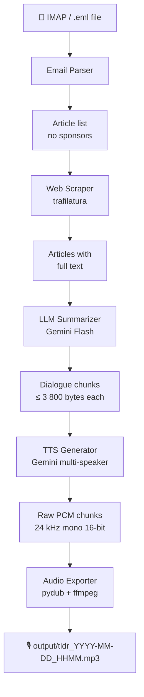

# tldr-podcast


Converts TLDR newsletters into a two-voice podcast MP3 using Gemini AI.

---

## 🏗️ Architecture



---

## ✨ Features

| Feature | Details |
| --- | --- |
| 📬 IMAP fetch | Retrieves unread TLDR emails via SSL |
| 🚫 Sponsor filter | Strips `TOGETHER WITH`, `SPONSOR`, ads |
| 🌐 Article scraping | Full text via trafilatura, fallback to summary |
| 🤖 AI curation | Gemini Flash selects 5-8 interesting stories |
| 🎙️ Two-voice TTS | Configurable speaker names and Gemini voices |
| 🎵 MP3 / WAV export | pydub + ffmpeg, auto-creates output directories |
| 🔍 Dry-run mode | Print dialogue without calling TTS |
| 📂 Local .eml mode | Test with a saved email, no IMAP required |

---

## 📦 Installation

### Prerequisites

- Python 3.13+
- [uv](https://docs.astral.sh/uv/) package manager
- ffmpeg

```bash
# Ubuntu / Debian
sudo apt-get install -y ffmpeg

# macOS
brew install ffmpeg
```

### Install with uv

```bash
git clone <repo-url> tldr-podcast
cd tldr-podcast

# Create virtual environment and install dependencies
uv sync
uv pip install -e .
```

---

## ⚙️ Configuration

Copy the example and fill in your values:

```bash
cp config.example.yaml config.yaml
```

```yaml
imap:
  host: imap.gmail.com
  port: 993
  username: your@email.com
  password_env: IMAP_PASSWORD   # name of env var holding the password
  folder: INBOX

gemini:
  api_key_env: GEMINI_API_KEY   # name of env var holding the API key
  text_model: gemini-2.0-flash
  tts_model: gemini-2.5-flash-preview-tts
  speaker1:
    name: Alex
    voice: Puck
  speaker2:
    name: Jordan
    voice: Charon

scraping:
  max_articles: 15
  timeout_seconds: 10

output:
  directory: output
  format: mp3           # mp3 or wav
```

Keys ending in `_env` reference environment variable **names** — the actual
secrets are never stored in the file.

### Environment Variables

| Variable | Description |
| --- | --- |
| `GEMINI_API_KEY` | Gemini API key (Google AI Studio) |
| `IMAP_PASSWORD` | IMAP account password |

Export them or add to a `.env` file:

```bash
export GEMINI_API_KEY="your-key"
export IMAP_PASSWORD="your-password"
```

---

## 🚀 Usage

| Command | Description |
| --- | --- |
| `python main.py --config config.yaml` | Fetch unread emails via IMAP and generate podcast |
| `python main.py --config config.yaml --eml file.eml` | Use a local `.eml` file |
| `python main.py --config config.yaml --eml file.eml --dry-run` | Print dialogue only, no TTS |
| `python main.py --config config.yaml --verbose` | Enable DEBUG logging |

### Example — dry-run on a saved email

```bash
python main.py \
  --config config.yaml \
  --eml "mails/Gemini 3.1 Pro.eml" \
  --dry-run
```

### Example — full pipeline

```bash
python main.py --config config.yaml --eml "mails/newsletter.eml"
# → output/tldr_2026-02-22_1430.mp3
```

---

## 🧪 Tests

```bash
uv run pytest tests/ -v
```

57 unit tests covering every module. All external APIs are mocked.

---

## 🗂️ Project Structure

```text
tldr-podcast/
├── main.py                    # Click CLI entry point
├── config.example.yaml        # Documented configuration template
├── pyproject.toml
├── src/tldr/
│   ├── config.py              # YAML loader with *_env resolution
│   ├── imap_client.py         # IMAP SSL client
│   ├── email_parser.py        # MIME parser → Article dataclass list
│   ├── web_scraper.py         # trafilatura scraper with fallback
│   ├── llm_summarizer.py      # Gemini Flash dialogue + chunking
│   ├── tts_generator.py       # Gemini multi-speaker TTS
│   └── audio_exporter.py      # PCM → MP3/WAV via pydub
├── tests/                     # 57 pytest unit tests
└── mails/                     # Sample .eml files for testing
```

---

## 📝 Notes

- Gemini TTS outputs raw PCM (24 kHz, mono, 16-bit). ffmpeg is required
  for MP3 encoding.
- The TTS API has a ~4 000-byte text limit per call. The summarizer
  automatically splits dialogue at speaker-turn boundaries.
- Sponsor sections (`TOGETHER WITH`, `SPONSOR`, etc.) are filtered out
  before article selection.

---

*Author: Grégoire Compagnon — <obeone@obeone.org>*
