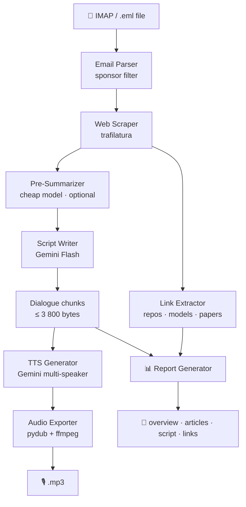

# tldr-podcast


Converts TLDR newsletters into a two-voice podcast MP3 using Gemini AI.

---

## 🏗️ Architecture



---

## ✨ Features

| Feature | Details |
| --- | --- |
| 📬 IMAP fetch | Retrieves unread TLDR emails via SSL, moves processed emails to a configurable folder |
| 📅 Date filter | Deduplicates emails per day with `--date YYYY-MM-DD` |
| 🚫 Sponsor filter | Strips `TOGETHER WITH`, `SPONSOR`, ads |
| 🌐 Article scraping | Full text via trafilatura, fallback to summary |
| 🔗 Link extraction | Categorises URLs into repos, models, papers, sources |
| 🤖 AI curation | Gemini Flash selects 8-12 interesting stories (configurable) |
| 📝 Pre-summarization | Optional cheap model summarizes articles before script writing |
| ⚡ Service tiers | Support for `flex` (cheaper) and `priority` (faster) API tiers |
| 🎙️ Two-voice TTS | Configurable speaker names, voices, and personalities |
| 🌍 Multi-language | Dialogue and TTS language configurable (`language` key) |
| 🎵 MP3 / WAV export | pydub + ffmpeg, auto-creates output directories |
| 📊 Report generation | Enabled by default — creates a timestamped folder with overview, articles, script, and links (`--no-report` to disable) |
| 💰 Token tracking | Real-time token usage and cost display on progress bars, tier-aware pricing |
| 🔍 Dry-run mode | Print dialogue without calling TTS |
| 📂 Local .eml mode | Test with a saved email, no IMAP required |
| 🔄 Retry logic | Automatic retry with backoff for transient API failures |
| 🛠️ Config wizard | Interactive `config init` to bootstrap your configuration |

---

## 📦 Installation

### Prerequisites

- Python 3.13+
- [uv](https://docs.astral.sh/uv/) package manager
- ffmpeg

```bash
# Ubuntu / Debian
sudo apt-get install -y ffmpeg

# macOS
brew install ffmpeg
```

### Install with uv

```bash
git clone <repo-url> tldr-podcast
cd tldr-podcast

# Install as a CLI tool
uv tool install .

# Or for development (editable install)
uv sync && uv pip install -e .
```

---

## ⚙️ Configuration

The default configuration file is `~/.config/tldr/config.yaml`.

Run the interactive wizard to create it — it guides you through each
setting and writes the file in the right place:

```bash
tldr-podcast config init
```

Alternatively, copy the example and edit manually:

```bash
cp config.example.yaml ~/.config/tldr/config.yaml
```

```yaml
imap:
  host: imap.gmail.com
  port: 993
  username: your@email.com
  password_env: IMAP_PASSWORD   # name of env var holding the password
  folder: INBOX
  seen_folder: TLDR/Seen        # folder for processed emails

gemini:
  api_key_env: GEMINI_API_KEY   # name of env var holding the API key
  text_model: gemini-2.0-flash
  # summary_model: gemini-2.0-flash-lite  # optional cheap pre-summarizer
  tts_model: gemini-2.5-flash-preview-tts
  # service_tier: flex          # optional: flex | priority (omit for standard)
  language: French              # dialogue and TTS language
  speaker1:
    name: Alex
    voice: Puck
    personality: "enthusiastic, curious, quick to get excited about tech innovations"
  speaker2:
    name: Jordan
    voice: Charon
    personality: "analytical, mildly skeptical, adds nuance and historical context"
  dialogue:
    min_articles: 8
    max_articles: 12
    target_word_count: 1200
  tts_style:
    pace: "slow and deliberate"
    scene: "Two friends co-hosting a casual French tech podcast in a cozy studio"
    temperature: 1.2             # expressiveness (0.0–2.0)

scraping:
  max_articles: 15
  timeout_seconds: 10

output:
  directory: output
  format: mp3                    # mp3 or wav

pricing:                         # USD per 1M tokens (for cost tracking)
  # Flat format (no tiers):
  gemini-2.0-flash:
    input_per_1m: 0.10
    output_per_1m: 0.40
  # Tier-aware format:
  gemini-2.5-flash:
    standard:
      input_per_1m: 0.30
      output_per_1m: 2.50
    flex:
      input_per_1m: 0.15
      output_per_1m: 1.25
    priority:
      input_per_1m: 0.54
      output_per_1m: 4.50
  gemini-2.5-flash-preview-tts:
    input_per_1m: 0.50
    output_per_1m: 10.00
```

Keys ending in `_env` reference environment variable **names** — the actual
secrets are never stored in the file.

### Environment Variables

| Variable | Description |
| --- | --- |
| `GEMINI_API_KEY` | Gemini API key (Google AI Studio) |
| `IMAP_PASSWORD` | IMAP account password |

Export them or add to a `.env` file:

```bash
export GEMINI_API_KEY="your-key"
export IMAP_PASSWORD="your-password"
```

---

## 🚀 Usage

### CLI Commands

All `run` commands use `~/.config/tldr/config.yaml` by default. Pass
`--config path/to/config.yaml` to override.

| Command | Description |
| --- | --- |
| `tldr-podcast run` | Fetch unread emails via IMAP and generate podcast + report |
| `tldr-podcast run -e file.eml` | Use a local `.eml` file |
| `tldr-podcast run -d 2026-03-15` | Target a specific date |
| `tldr-podcast run -e file.eml -n` | Print dialogue only, no TTS (dry-run) |
| `tldr-podcast run -R` | Skip report generation (`--no-report`) |
| `tldr-podcast run --no-progress` | Disable rich progress bar |
| `tldr-podcast run -v` | Enable DEBUG logging |
| `tldr-podcast config init` | Interactive configuration wizard |
| `tldr-podcast config show` | Display the current configuration |
| `tldr-podcast config show --resolve` | Display config with resolved env vars (masked) |

**Short flags:** `-c` config, `-e` eml, `-d` date, `-n` dry-run, `-v` verbose, `-r`/`-R` report/no-report, `-h` help.

### Example — dry-run on a saved email

```bash
tldr-podcast run -e "mails/Gemini 3.1 Pro.eml" -n
```

### Example — full pipeline (report is generated by default)

```bash
tldr-podcast run -e "mails/newsletter.eml"
# → output/tldr_2026-02-22_1430.mp3
# → output/tldr_2026-02-22_1430/overview.md    (metadata, sections, token costs)
# → output/tldr_2026-02-22_1430/articles.md    (titles, summaries, full text)
# → output/tldr_2026-02-22_1430/script.md      (dialogue script)
# → output/tldr_2026-02-22_1430/summary.md     (categorised links)
```

---

## 🧪 Tests

```bash
uv run pytest tests/ -v
```

168 unit tests covering every module. All external APIs are mocked.

---

## 🗂️ Project Structure

```text
tldr-podcast/
├── config.example.yaml        # Documented configuration template
├── pyproject.toml
├── src/tldr/
│   ├── cli.py                 # Click CLI entry point (group with subcommands)
│   ├── config.py              # YAML loader with *_env resolution
│   ├── imap_client.py         # IMAP SSL client
│   ├── email_parser.py        # MIME parser → Article dataclass list
│   ├── web_scraper.py         # trafilatura scraper with fallback
│   ├── link_extractor.py      # URL extraction and categorisation
│   ├── llm_summarizer.py      # Gemini Flash dialogue + chunking
│   ├── tts_generator.py       # Gemini multi-speaker TTS
│   ├── audio_exporter.py      # PCM → MP3/WAV via pydub
│   ├── report_generator.py    # Timestamped report folder output
│   ├── token_tracker.py       # Token usage and cost tracking
│   └── retry.py               # Retry with exponential backoff
├── tests/                     # 168 pytest unit tests (13 files)
└── mails/                     # Sample .eml files for testing
```

---

## 📝 Notes

- Gemini TTS outputs raw PCM (24 kHz, mono, 16-bit). ffmpeg is required
  for MP3 encoding.
- The TTS API has a ~4 000-byte text limit per call. The summarizer
  automatically splits dialogue at speaker-turn boundaries.
- Sponsor sections (`TOGETHER WITH`, `SPONSOR`, etc.) are filtered out
  before article selection.
- Token costs are tracked live and displayed at the end of each run.
- Pricing supports both flat and tier-aware formats — the active tier is
  selected by `gemini.service_tier` in your config.

---

*Author: Grégoire Compagnon — <obeone@obeone.org>*
