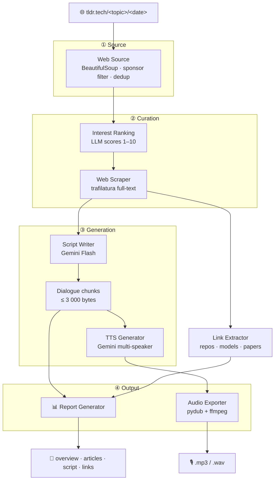

<!-- markdownlint-disable MD033 MD041 -->
<div align="center">

# 🎙️ tldr-podcast

**Turn your TLDR newsletters into a listenable two-voice podcast — automatically.**


Fetches any combination of [TLDR](https://tldr.tech) topic newsletters,
LLM-scores the articles, and generates a scripted dialogue + audio via
Gemini AI. **No email account, no subscription, no API beyond Gemini.**

</div>

---

## 📑 Table of Contents

- [✨ Features](#features)
- [🧭 Pipeline](#pipeline)
- [📦 Installation](#installation)
- [🚀 Quick start](#quick-start)
- [📰 Topics](#topics)
- [⚙️ Configuration](#configuration)
- [🖥️ CLI reference](#cli-reference)
- [🐚 Shell completions](#shell-completions)
- [🧪 Tests](#tests)
- [🏷️ Releasing](#releasing)
- [🗂️ Project structure](#project-structure)
- [📜 Changelog](#changelog)

---

<a id="features"></a>

## ✨ Features

| | Feature | What it does |
| :-: | --- | --- |
| 🌐 | **Zero-config fetching** | Pulls newsletters straight from `tldr.tech` — no inbox, no scraping your mail |
| 🧠 | **Smart curation** | An LLM interest-scores every article 1–10 *before* scraping; only the best survive |
| 🗣️ | **Two-voice dialogue** | Configurable speaker names, Gemini voices, personalities, and language |
| 🎭 | **Expressive delivery** | Inline audio tags (`[laughs]`, `[short pause]`, `[enthusiasm]`) on Gemini 3.x TTS; graceful fallback on older models |
| 🗂️ | **Per-run reports** | Overview, full article list, script, and extracted links (repos · papers · models) |
| 🕵️ | **Stealth browser fallback** | Optional CloakBrowser (Playwright stealth Chromium) re-renders pages that block trafilatura |
| 🔁 | **Self-upgrading config** | Versioned schema; missing keys are added in place, old file kept as `.bak` |
| 💸 | **Cost tracking** | Live token usage and a USD estimate at the end of every run |
| 🔇 | **Dry & no-audio modes** | Preview the script without ever calling TTS |
| 🎚️ | **Flexible output** | MP3 or WAV, custom output directory |

---

<a id="pipeline"></a>

## 🧭 Pipeline



---

<a id="installation"></a>

## 📦 Installation

Requires **Python 3.13+** and **[ffmpeg](https://ffmpeg.org)**.

```bash
# macOS
brew install ffmpeg

# Ubuntu / Debian
sudo apt-get install -y ffmpeg
```

<details>
<summary><b>From GitHub — no clone needed</b></summary>

```bash
# uv (recommended)
uv tool install git+https://github.com/obeone/tldr-podcast

# uvx — run once, install nothing permanently
uvx --from git+https://github.com/obeone/tldr-podcast tldr-podcast run -t ai --no-interactive

# pipx
pipx install git+https://github.com/obeone/tldr-podcast

# pip (inside an active venv)
pip install git+https://github.com/obeone/tldr-podcast
```

</details>

<details>
<summary><b>From a local clone</b></summary>

```bash
git clone https://github.com/obeone/tldr-podcast
cd tldr-podcast

uv tool install .                 # install as a CLI tool
# or, for development:
uv sync && uv pip install -e .    # editable install
```

</details>

---

<a id="quick-start"></a>

## 🚀 Quick start

```bash
# 1. Create your config interactively
tldr-podcast config init

# 2. Export your Gemini API key
export GEMINI_API_KEY="your-key"

# 3. Pick topics interactively and generate
tldr-podcast run

# …or go straight to it
tldr-podcast run -t ai,devops --no-interactive
```

---

<a id="topics"></a>

## 📰 Topics

13 TLDR newsletters, mix and match freely:

| Slug | Newsletter | Slug | Newsletter |
| --- | --- | --- | --- |
| `ai` | AI | `design` | Design |
| `infosec` | Information Security | `product` | Product |
| `devops` | DevOps | `marketing` | Marketing |
| `tech` | Tech (the flagship) | `data` | Data |
| `crypto` | Crypto | `fintech` | Fintech |
| `founders` | Founders | `dev` | Web Dev |
| `it` | Information Technology | | |

---

<a id="configuration"></a>

## ⚙️ Configuration

The wizard covers every option and writes a ready-to-use `config.yaml`:

```bash
tldr-podcast config init
```

Default path: `$XDG_CONFIG_HOME/tldr/config.yaml`
(falls back to `~/.config/tldr/config.yaml`).

A minimal config looks like this:

```yaml
config_version: 6

web:
  default_topics: [ ai, infosec, devops ]

gemini:
  api_key_env: GEMINI_API_KEY        # name of the env var — never the key itself
  text_model: gemini-2.0-flash
  tts_model: gemini-2.5-flash-preview-tts
  language: French
  speaker1: { name: Alex,   voice: Puck,   personality: "enthusiastic, curious" }
  speaker2: { name: Jordan, voice: Charon, personality: "analytical, skeptical" }

output:
  dir: "."
  format: mp3
```

> 🔐 The only required secret is `GEMINI_API_KEY`. Secrets are **never**
> written to the file — keys ending in `_env` hold the **name** of the
> environment variable read at runtime.

For fine-grained tuning (TTS pace, dialogue style, service tiers,
per-model pricing…), every key is documented inline in
[`config.example.yaml`](config.example.yaml).

### Stealth browser fallback (optional)

When trafilatura fails to fetch or extract an article (bot-detection,
JS-rendered pages, etc.), the scraper can fall back to
[CloakBrowser](https://pypi.org/project/cloakbrowser/) — a Playwright-based
stealth Chromium that bypasses most bot-detection measures.

The browser binary (~200 MB) is downloaded automatically at **first runtime
use**, not at install time.

**Install the optional extra:**

```bash
# uv
uv tool install ".[cloak]"

# pip / pipx
pip install "tldr-podcast[cloak]"
```

**Config key** (`scraping.cloak_fallback`):

| Value | Behaviour |
| --- | --- |
| `auto` *(default)* | Use the fallback when the `cloakbrowser` package is importable |
| `on` | Require the fallback; warns and degrades to newsletter summaries if not installed |
| `off` | Never use the browser fallback |

```yaml
scraping:
  cloak_fallback: auto   # auto | on | off
```

After navigation, the fallback automatically waits up to 35 seconds for
any Cloudflare Turnstile challenge to resolve before reading the page.

At most 2 stealth-browser sessions run concurrently to avoid memory
exhaustion; trafilatura workers are unaffected.

> **Known limitation:** heavily fortified sites using enterprise bot
> management (e.g. g2.com) may still be blocked — the fallback handles
> standard Cloudflare challenges, not every anti-bot system.

```bash
tldr-podcast config show              # raw config
tldr-podcast config show --resolve    # env vars resolved, secrets masked
```

---

<a id="cli-reference"></a>

## 🖥️ CLI reference

| Command | Description |
| --- | --- |
| `tldr-podcast run` | Interactive topic picker → generate podcast |
| `tldr-podcast run -t ai,devops` | Explicit topics, skip the prompt |
| `tldr-podcast run -t ai --no-interactive` | Non-interactive, use config defaults if no `-t` |
| `tldr-podcast run -d 2026-04-06` | Target a specific date |
| `tldr-podcast run -t ai -n` | Dry-run: print dialogue, skip TTS |
| `tldr-podcast run -t ai -A` | Generate script + report, skip TTS and audio |
| `tldr-podcast run -R` | Disable report generation |
| `tldr-podcast run -o ./podcasts` | Custom output directory |
| `tldr-podcast config init` | Interactive configuration wizard |
| `tldr-podcast config show` | Display current config |
| `tldr-podcast completions SHELL` | Print completion script (bash/zsh/fish) |
| `tldr-podcast --version` | Print the installed version and exit |

**Short flags:** `-c` config · `-t` topics · `-d` date · `-o` output-dir ·
`-n` dry-run · `-A` no-audio · `-v` verbose · `-r`/`-R` report/no-report ·
`-h` help

### Output naming

Topics are sorted alphabetically and joined with the date:

```text
ai-devops-2026-04-17.mp3
ai-devops-2026-04-17/
├── overview.md
├── articles.md
├── script.md
└── summary.md
```

---

<a id="shell-completions"></a>

## 🐚 Shell completions

Generate and install a completion script for your shell. Write to a
file — **do not** pipe into `eval`.

<details>
<summary><b>bash · zsh · fish</b></summary>

```bash
# Bash — user completion directory (auto-sourced by bash-completion)
mkdir -p ~/.local/share/bash-completion/completions
tldr-podcast completions bash > ~/.local/share/bash-completion/completions/tldr-podcast

# Zsh — a directory on $fpath
mkdir -p ~/.zsh/completions
tldr-podcast completions zsh > ~/.zsh/completions/_tldr-podcast
# ensure ~/.zshrc contains:
#   fpath=(~/.zsh/completions $fpath)
#   autoload -Uz compinit && compinit

# Fish — auto-sourced on next shell start
tldr-podcast completions fish > ~/.config/fish/completions/tldr-podcast.fish
```

</details>

---

<a id="tests"></a>

## 🧪 Tests

```bash
uv run pytest tests/ -v
```

All external APIs (Gemini, HTTP) are mocked. A real captured TLDR HTML
page in `tests/fixtures/` drives realistic parse validation.

---

<a id="releasing"></a>

## 🏷️ Releasing

Releases are automated by
[`.github/workflows/publish.yml`](.github/workflows/publish.yml). Bumping
`version` in `pyproject.toml` and pushing to `main` runs, in order:

1. **Tests** — `uv run pytest` must pass; a red suite blocks the release.
2. **PyPI publish** — built with `uv build` and uploaded via
   [Trusted Publishing](https://docs.pypi.org/trusted-publishers/) (OIDC, no
   stored token). Requires a publisher configured on PyPI for project
   `tldr-podcast`, repository `obeone/tldr-podcast`, workflow `publish.yml`,
   environment `pypi`.
3. **GitHub release** — a `v<version>` tag plus a release with
   auto-generated notes.

Dependency-only edits to `pyproject.toml` are ignored (the `version` value
must actually change), and an already-released version is skipped, so re-runs
and unrelated edits are safe no-ops.

---

<a id="project-structure"></a>

## 🗂️ Project structure

```text
tldr-podcast/
├── config.example.yaml         # Fully documented configuration template
├── pyproject.toml
├── src/tldr/
│   ├── cli.py                  # Click CLI (run · config · completions)
│   ├── config.py               # YAML loader with *_env resolution
│   ├── config_migrations.py    # Versioned schema + in-place auto-upgrade
│   ├── models.py               # Shared Article dataclass
│   ├── web_source.py           # tldr.tech fetcher + parser
│   ├── web_scraper.py          # trafilatura full-text scraper
│   ├── link_extractor.py       # URL extraction and categorisation
│   ├── llm_summarizer.py       # Interest ranking + dialogue generation
│   ├── tts_generator.py        # Gemini multi-speaker TTS
│   ├── audio_exporter.py       # PCM → MP3/WAV via pydub
│   ├── report_generator.py     # Timestamped report folder output
│   ├── token_tracker.py        # Token usage and cost tracking
│   └── retry.py                # Retry with exponential backoff
└── tests/
    ├── fixtures/               # Real captured HTML for parse tests
    └── …                       # pytest unit tests (all APIs mocked)
```

---

<a id="changelog"></a>

## 📜 Changelog

| Version | Highlights |
| --- | --- |
| **1.7.0** | Optional CloakBrowser stealth-browser fallback (`scraping.cloak_fallback: auto\|on\|off`); config schema v4 |
| **1.6.x** | Dependency security bumps; `trafilatura` 2.0 scraper user-agent fix |
| **1.5.0** | `--version` flag on the top-level group |
| **1.4.0** | Audio-tag support for Gemini 3.x Flash TTS; versioned config schema (`config_version`) with in-place auto-upgrade + backup |
| **1.3.0** | Shell completion support (`completions bash\|zsh\|fish`) |
| **1.2.0** | Numbered topic recap in the conclusion; `--no-audio` flag; out-of-order TTS progress bar |
| **1.0.0** | **Breaking** — switched from IMAP/email to direct web scraping of [tldr.tech](https://tldr.tech). No account or credentials needed; removed `-e/--eml`, `-s/--status` and the `imap:` config section |

---

<div align="center">

Made with 🎧 by **Grégoire Compagnon** — [obeone@obeone.org](mailto:obeone@obeone.org)

</div>
